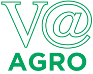

<table>
<tr>
<td>

</td>
<td>
</td>
</tr>
</table>

# Projeto: Identificação e Monitoramento de Saúde de Bovinos usando Câmeras Termográficas

# Empresa: Agropecuária Vista Alegre Ltda

A Agropecuária Vista Alegre, pertencente ao Frigorífico Better Beef localizado na região de Presidente Prudente – SP, atua no segmento de pecuária de corte, tendo como sua operação principal a compra e engorda de bovinos para abate no modelo de confinamento. A Agropecuária Vista Alegre fornece toda sua produção de bovinos para o Frigorífico Better Beef.

# Grupo: Grupo 1

# Integrantes:

* [Arthur Tsukamoto](https://www.linkedin.com/in/arthur-tsukamoto/)
* [Bruno Wasserstein](https://www.linkedin.com/in/bruno-wasserstein/)
* [Esther Hikari Kimura Nunes](https://www.linkedin.com/in/estherhikari/)
* [Henrique Godoy](https://www.linkedin.com/in/henrique-godoy-879138252/)
* [Fabio Piemonte](https://www.linkedin.com/in/fabio-piemonte-823a65211/)

# Descrição do Projeto

Desenvolvimento e entrega de modelos de machine learning treinados para a análise de
imagens termográficas, visando a medição da temperatura dos bovinos e a predição de
enfermidades.

# Documentação e Artigo

Os arquivos da documentação deste projeto estão na pasta [/artefatos](/artefatos), inclusive os arquivos do artigo.

O conteúdo deste artigo foi elaborado como parte das atividades de aprendizado dos alunos, mas precisa ser revisto e modificado caso haja a intenção de submetê-lo para uma eventual publicação.

# Código

Os arquivos de código estão na pasta [/codigo](/codigo).

# Tags

Foi publicada uma tag ao final de cada sprint, para que seja possível verificar a evolução do projeto ao longo do tempo, a partir desses checkpoints.

# Releases

* SPRINT1:
    - Coleta e Processamento de Imagens de Olhos Bovinos

* SPRINT2:
    - Implementação de Modelo CNN Próprio - Classificação de Bovinos em Imagens

* SPRINT3:
    - Implementação de Object Detection dos Olhos de Bovinos
 
* SPRINT4:
    - Implementação de Image Segmentation
    
## Licença

<a property="dct:title" rel="cc:attributionURL">G1</a> by <a rel="cc:attributionURL dct:creator" property="cc:attributionName">Inteli, Arthur Tsukamoto, Bruno Wasserstein, Esther Hikari Kimura Nunes, Henrique Godoy, Henrique Rodrigues de Godoy, Fabio Piemonte</a> is licensed under <a href="https://creativecommons.org/licenses/by/4.0/?ref=chooser-v1" rel="license noopener noreferrer" style="display:inline-block;">Attribution 4.0 International</a>.

