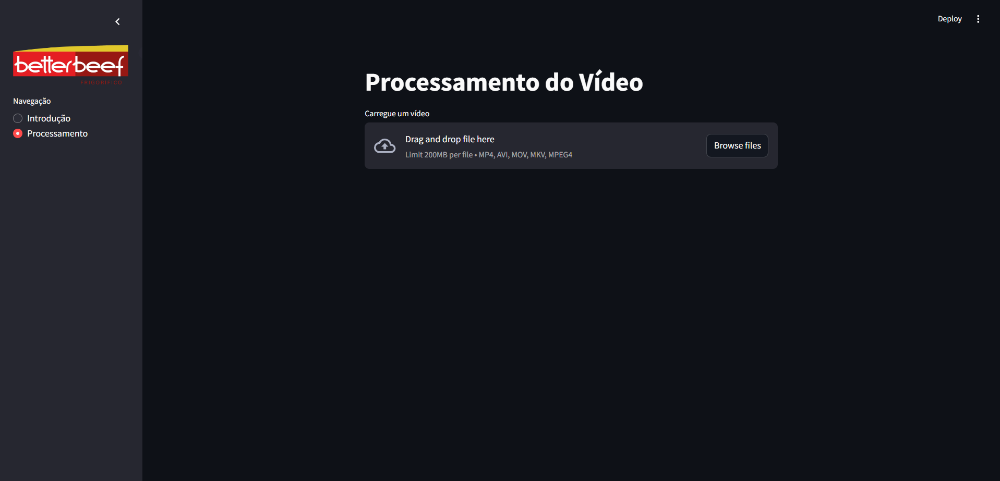

# Iniciar o Frontend

Para inicializar o frontend e conseguir fazer o processamento de vídeo, é necessário o diretório.

```
 .\frontend
```

Para isso usamos o seguinte comando no terminal.

```
cd .\codigo\active\frontend\
```

Caso não tenha o arquivo venv no diretório do frontend, devemos cria-lo:

```
python -m venv venv
```

Em seguida, será necessário iniciar o ambiente virtual do python, onde as depedências estão instaladas.

```
.\venv\Scripts\activate
```

Para identificar se está no ambiente venv, terá escrito "(venv)" antes do seu path no diretorio.

```
(venv) PS C:\Users\usuario\Desktop\repositorio\exemplo\exemplo\exemplo>
```

Dentro do ambiente, instalamos as depedências necessários

```
pip install -r requirements.txt
```

Com as depedências baixadas, iniciamos o frontend com o comando:

```
streamlit run .\app.py
```

