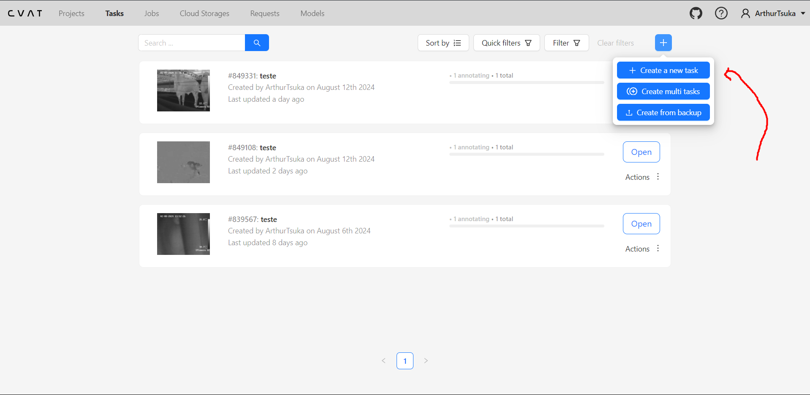

## Processamento de Imagens e Vídeos
Esse README tem como objetivo explicar como utilizar os códigos 
para fazer o processamento de imagens e vídeos.

Para ambos os casos, será necessário o uso da ferramenta online CVAT(Computer Vision Annotation Tool).

Indepedente da escolha entre Imagem ou vídeo, precisamos criar um Project e adicionar os labels necessários: "cabeca", "olho".


<p align="center"><i>Criação do projeto</i></p>

Em seguida, acessamos o projeto e criamos umas Task, onde iremos adicionar as imagens ou vídeos que queremos adicionar os labels da cabeça e dos olhos.


<p align="center"><i>Criação da Task - Parte 1</i></p>


<p align="center"><i>Criação da Task - Parte 2</i></p>

Com a Task criada, temos que criar um Job, local que iremos colocar as labels nas imagens.


<p align="center"><i>Criação do Job - Parte 1</i></p>


<p align="center"><i>Criação do Job - Parte 2</i></p>

Com o job adicionado, vamo até a aba do Job e acessamos o Job criado.


<p align="center"><i>Página do Job</i></p>

Ao clicar duas vezes no job, é realizado um direcionamento para a página de edição.


<p align="center"><i>Criação dos Labels - Parte 1</i></p>

Nessa página, iremos determinar o tamanho das labels e o label que iremos selecionar para as imagens.


<p align="center"><i>Criação dos Labels - Parte 2</i></p>

Selecionando o label "cabeca", preenchemos a cabeça do Animal e logo em seguida, selecionamos o label do "Olho" e selecionamos o olho do Animal, caso exista.


<p align="center"><i>Criação do Labels - Parte 3</i></p>


<p align="center"><i>Criação do Labels - Parte 4</i></p>


<p align="center"><i>Criação do Labels - Parte 5</i></p>

Depois de selecionar os labels, salvamos as alterações e acessamos o menu para exportar o arquivo XML com as coordenadas de todos os labels.


<p align="center"><i>Salvando alterações</i></p>


<p align="center"><i>Menu</i></p>

Ao selecionar "Export Job Dataset", é realizado um direcionamento para um modal de exportação, onde selecionamos o formato que queremos exportar.

Caso queira exportar imagem, selecione "CVAT For Images 1.1"


<p align="center"><i>Exportação Image</i></p>

Caso queira exportar imagem, selecione "CVAT For Video 1.1"


<p align="center"><i>Exportação Video</i></p>

Dependendo da escolha entre exportaçã, utilizaremos códigos diferentes para realizar o "cropping" das imagens ou vídeos.

Acesse o diretório export_imagem, caso tenha selecionado a exportação por imagem. Se optou pela exportação de Vídeo, acesse a pasta export_video.

### Cropping da Exportação de Imagens

No caso da imagens, os únicos passos necessários são adicionar as imagens que voce quer cortar(Mesmas imagens que foi utilizada no CVAT). Além disso, é preciso importar o arquivo XML que foi exportado do CVAT.


<p align="center"><i>Exportação Video</i></p>

Com todas as pasta necessários, vamos acessar o diretório "processamento_imagem_e_video" para baixar as depedências necessárias.

```
cd .\codigo\processamento_imagem_e_video
```
No diretório correto, baixamos as depedências

```
pip install -r requirements.txt
```
Com tudo baixado, acessamos o diretório "export_imagem".

```
cd .\export_imagem\
```

No diretório de exportar imagens, utilizamos o script "imagens_x.py" que tem como objetivo recortar as imagens das cabeças dos animais com um contexto. O recorte é realizado conforme as coordenadas presentes no arquivo XML, exportado do CVAT.

```
python .\imagens_x.py 
```

Será criado uma nova pasta, com todas as imagens recortadas. Caso de erro nessa parte, verifique de mudar o Path das variavéis no código "imagens_x.py"


<p align="center"><i>Código imagens_x</i></p>

Após a criação das imagens X, realizaremos o mesmo processo para as imagens Y, representando a cabeça e olhos dos animais.

No mesmo diretório:

```
python .\imagens_y.py
```

Ao rodar esse código, uma nova pasta será criada, contendo todas as imagens Y, recortadas conforme os labels criados no CVAT. Caso de erro nessa parte, verifique de mudar o Path das variavéis no código "imagens_y.py"


<p align="center"><i>Código imagens_y</i></p>

Com isso, conseguimos ter as duas imagens necessárias, já redimensionadas para 128x128.


<p align="center"><i>1 Cabeça, 1 Olho</i></p>


<p align="center"><i>1 Cabeça, 2 Olhos</i></p>


<p align="center"><i>1 Cabeça, 0 Olhos</i></p>

### Cropping da Exportação de Videos

No caso dos vídeos, os únicos passos necessários são adicionar o vídeo e transforma-lô em frames. Além disso, é preciso importar o arquivo XML que foi exportado do CVAT.


<p align="center"><i>Exportação Video</i></p>

Com todas as pasta necessários, vamos acessar o diretório "processamento_imagem_e_video" para baixar as depedências necessárias.

```
cd .\codigo\processamento_imagem_e_video
```
No diretório correto, baixamos as depedências

```
pip install -r requirements.txt
```
Com tudo baixado, acessamos o diretório "export_video".

```
cd .\export_video\
```

No diretório de exportar vídeo, utilizamos o script "frame.py" que tem como objetivo transformar o vídeo em frames.

```
python .\frame.py
```

Caso de "Erro ao abrir o vídeo:", acesse o arquivo frame.py e modifique a variável.


<p align="center"><i>Path Vídeo</i></p>

Com o nome correto, rode novamente o arquivo frame.py. Será criado uma nova pasta com todos frames daquele vídeo.

Em seguida, rode o arquivo "imagens_x.py":
```
python .\imagens_x.py 
```

Será criado uma nova pasta, com todas as imagens recortadas. Caso de erro nessa parte, verifique de mudar o Path das variavéis no código "imagens_x.py"


<p align="center"><i>Código imagens_x</i></p>

Após a criação das imagens X, realizaremos o mesmo processo para as imagens Y, representando a cabeça e olhos dos animais.

No mesmo diretório:

```
python .\imagens_y.py
```

Ao rodar esse código, uma nova pasta será criada, contendo todas as imagens Y, recortadas conforme os labels criados no CVAT. Caso de erro nessa parte, verifique de mudar o Path das variavéis no código "imagens_y.py"


<p align="center"><i>Código imagens_y</i></p>

Com isso, conseguimos ter as duas imagens necessárias, já redimensionadas para 128x128.

