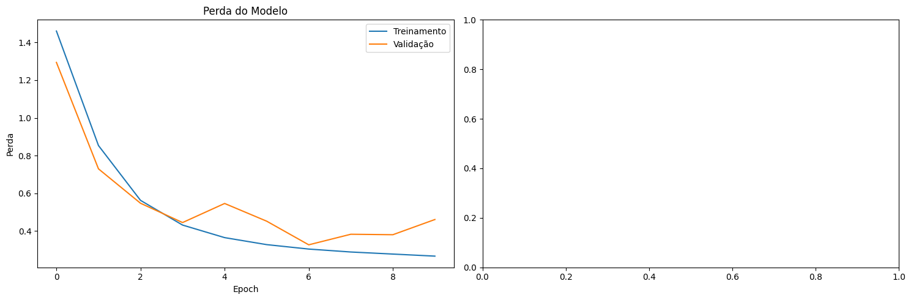

# Evolução dos Modelos de Segmentação de Imagens

## Introdução

Este texto apresenta uma série de experimentos conduzidos para desenvolver um modelo eficiente de segmentação de imagens. O processo envolveu a exploração de várias arquiteturas e técnicas, com foco na otimização do desempenho e na redução do número de parâmetros.

## Experimento 1: U-Net Básica

### Arquitetura
Implementamos uma arquitetura U-Net básica, caracterizada por:
- Camadas de convolução e max pooling no encoder
- Camadas de convolução transposta no decoder
- Conexões skip entre encoder e decoder

### Função de Perda
Utilizamos uma função de perda personalizada que combina:
- Focal Loss para lidar com o desbalanceamento de classes
- Penalização baseada em distância de clusters para melhorar a coerência espacial das previsões

### Resultados
O modelo segmentou apenas alguns pontos, indicando a necessidade de melhorias.

## Experimento 2: U-Net + VGG16 + Blocos Residuais

### Arquitetura
Aprimoramos o modelo anterior incorporando:
- VGG16 pré-treinado como encoder
- Blocos residuais no decoder
- Função de perda combinando Focal Loss e Dice Loss

<pre style="white-space:pre;overflow-x:auto;line-height:normal;font-family:Menlo,'DejaVu Sans Mono',consolas,'Courier New',monospace">┏━━━━━━━━━━━━━━━━━━━━━━━━━━━┳━━━━━━━━━━━━━━━━━━━━━━━━┳━━━━━━━━━━━━━━━━┳━━━━━━━━━━━━━━━━━━━━━━━━┓
┃ Layer (type)              ┃ Output Shape           ┃        Param # ┃ Connected to           ┃
┡━━━━━━━━━━━━━━━━━━━━━━━━━━━╇━━━━━━━━━━━━━━━━━━━━━━━━╇━━━━━━━━━━━━━━━━╇━━━━━━━━━━━━━━━━━━━━━━━━┩
│ input_layer_7             │ (None, 128, 128, 3)    │              0 │ -                      │
│ (InputLayer)              │                        │                │                        │
├───────────────────────────┼────────────────────────┼────────────────┼────────────────────────┤
│ block1_conv1 (Conv2D)     │ (None, 128, 128, 64)   │          1,792 │ input_layer_7[0][0]    │
├───────────────────────────┼────────────────────────┼────────────────┼────────────────────────┤
│ block1_conv2 (Conv2D)     │ (None, 128, 128, 64)   │         36,928 │ block1_conv1[0][0]     │
├───────────────────────────┼────────────────────────┼────────────────┼────────────────────────┤
│ block1_pool               │ (None, 64, 64, 64)     │              0 │ block1_conv2[0][0]     │
│ (MaxPooling2D)            │                        │                │                        │
├───────────────────────────┼────────────────────────┼────────────────┼────────────────────────┤
│ block2_conv1 (Conv2D)     │ (None, 64, 64, 128)    │         73,856 │ block1_pool[0][0]      │
├───────────────────────────┼────────────────────────┼────────────────┼────────────────────────┤
│ block2_conv2 (Conv2D)     │ (None, 64, 64, 128)    │        147,584 │ block2_conv1[0][0]     │
├───────────────────────────┼────────────────────────┼────────────────┼────────────────────────┤
│ block2_pool               │ (None, 32, 32, 128)    │              0 │ block2_conv2[0][0]     │
│ (MaxPooling2D)            │                        │                │                        │
├───────────────────────────┼────────────────────────┼────────────────┼────────────────────────┤
│ block3_conv1 (Conv2D)     │ (None, 32, 32, 256)    │        295,168 │ block2_pool[0][0]      │
├───────────────────────────┼────────────────────────┼────────────────┼────────────────────────┤
│ block3_conv2 (Conv2D)     │ (None, 32, 32, 256)    │        590,080 │ block3_conv1[0][0]     │
├───────────────────────────┼────────────────────────┼────────────────┼────────────────────────┤
│ block3_conv3 (Conv2D)     │ (None, 32, 32, 256)    │        590,080 │ block3_conv2[0][0]     │
├───────────────────────────┼────────────────────────┼────────────────┼────────────────────────┤
│ block3_pool               │ (None, 16, 16, 256)    │              0 │ block3_conv3[0][0]     │
│ (MaxPooling2D)            │                        │                │                        │
├───────────────────────────┼────────────────────────┼────────────────┼────────────────────────┤
│ block4_conv1 (Conv2D)     │ (None, 16, 16, 512)    │      1,180,160 │ block3_pool[0][0]      │
├───────────────────────────┼────────────────────────┼────────────────┼────────────────────────┤
│ block4_conv2 (Conv2D)     │ (None, 16, 16, 512)    │      2,359,808 │ block4_conv1[0][0]     │
├───────────────────────────┼────────────────────────┼────────────────┼────────────────────────┤
│ block4_conv3 (Conv2D)     │ (None, 16, 16, 512)    │      2,359,808 │ block4_conv2[0][0]     │
├───────────────────────────┼────────────────────────┼────────────────┼────────────────────────┤
│ block4_pool               │ (None, 8, 8, 512)      │              0 │ block4_conv3[0][0]     │
│ (MaxPooling2D)            │                        │                │                        │
├───────────────────────────┼────────────────────────┼────────────────┼────────────────────────┤
│ block5_conv1 (Conv2D)     │ (None, 8, 8, 512)      │      2,359,808 │ block4_pool[0][0]      │
├───────────────────────────┼────────────────────────┼────────────────┼────────────────────────┤
│ block5_conv2 (Conv2D)     │ (None, 8, 8, 512)      │      2,359,808 │ block5_conv1[0][0]     │
├───────────────────────────┼────────────────────────┼────────────────┼────────────────────────┤
│ block5_conv3 (Conv2D)     │ (None, 8, 8, 512)      │      2,359,808 │ block5_conv2[0][0]     │
├───────────────────────────┼────────────────────────┼────────────────┼────────────────────────┤
│ up_sampling2d_28          │ (None, 16, 16, 512)    │              0 │ block5_conv3[0][0]     │
│ (UpSampling2D)            │                        │                │                        │
├───────────────────────────┼────────────────────────┼────────────────┼────────────────────────┤
│ concatenate_28            │ (None, 16, 16, 1024)   │              0 │ up_sampling2d_28[0][0… │
│ (Concatenate)             │                        │                │ block4_conv3[0][0]     │
├───────────────────────────┼────────────────────────┼────────────────┼────────────────────────┤
│ conv2d_175 (Conv2D)       │ (None, 16, 16, 512)    │      4,719,104 │ concatenate_28[0][0]   │
├───────────────────────────┼────────────────────────┼────────────────┼────────────────────────┤
│ batch_normalization_68    │ (None, 16, 16, 512)    │          2,048 │ conv2d_175[0][0]       │
│ (BatchNormalization)      │                        │                │                        │
├───────────────────────────┼────────────────────────┼────────────────┼────────────────────────┤
│ activation_116            │ (None, 16, 16, 512)    │              0 │ batch_normalization_6… │
│ (Activation)              │                        │                │                        │
├───────────────────────────┼────────────────────────┼────────────────┼────────────────────────┤
│ dropout_34 (Dropout)      │ (None, 16, 16, 512)    │              0 │ activation_116[0][0]   │
├───────────────────────────┼────────────────────────┼────────────────┼────────────────────────┤
│ conv2d_176 (Conv2D)       │ (None, 16, 16, 512)    │      2,359,808 │ dropout_34[0][0]       │
├───────────────────────────┼────────────────────────┼────────────────┼────────────────────────┤
│ batch_normalization_69    │ (None, 16, 16, 512)    │          2,048 │ conv2d_176[0][0]       │
│ (BatchNormalization)      │                        │                │                        │
├───────────────────────────┼────────────────────────┼────────────────┼────────────────────────┤
│ activation_117            │ (None, 16, 16, 512)    │              0 │ batch_normalization_6… │
│ (Activation)              │                        │                │                        │
├───────────────────────────┼────────────────────────┼────────────────┼────────────────────────┤
│ conv2d_177 (Conv2D)       │ (None, 16, 16, 512)    │        524,800 │ concatenate_28[0][0]   │
├───────────────────────────┼────────────────────────┼────────────────┼────────────────────────┤
│ add_58 (Add)              │ (None, 16, 16, 512)    │              0 │ activation_117[0][0],  │
│                           │                        │                │ conv2d_177[0][0]       │
├───────────────────────────┼────────────────────────┼────────────────┼────────────────────────┤
│ up_sampling2d_29          │ (None, 32, 32, 512)    │              0 │ add_58[0][0]           │
│ (UpSampling2D)            │                        │                │                        │
├───────────────────────────┼────────────────────────┼────────────────┼────────────────────────┤
│ concatenate_29            │ (None, 32, 32, 768)    │              0 │ up_sampling2d_29[0][0… │
│ (Concatenate)             │                        │                │ block3_conv3[0][0]     │
├───────────────────────────┼────────────────────────┼────────────────┼────────────────────────┤
│ conv2d_178 (Conv2D)       │ (None, 32, 32, 256)    │      1,769,728 │ concatenate_29[0][0]   │
├───────────────────────────┼────────────────────────┼────────────────┼────────────────────────┤
│ batch_normalization_70    │ (None, 32, 32, 256)    │          1,024 │ conv2d_178[0][0]       │
│ (BatchNormalization)      │                        │                │                        │
├───────────────────────────┼────────────────────────┼────────────────┼────────────────────────┤
│ activation_118            │ (None, 32, 32, 256)    │              0 │ batch_normalization_7… │
│ (Activation)              │                        │                │                        │
├───────────────────────────┼────────────────────────┼────────────────┼────────────────────────┤
│ dropout_35 (Dropout)      │ (None, 32, 32, 256)    │              0 │ activation_118[0][0]   │
├───────────────────────────┼────────────────────────┼────────────────┼────────────────────────┤
│ conv2d_179 (Conv2D)       │ (None, 32, 32, 256)    │        590,080 │ dropout_35[0][0]       │
├───────────────────────────┼────────────────────────┼────────────────┼────────────────────────┤
│ batch_normalization_71    │ (None, 32, 32, 256)    │          1,024 │ conv2d_179[0][0]       │
│ (BatchNormalization)      │                        │                │                        │
├───────────────────────────┼────────────────────────┼────────────────┼────────────────────────┤
│ activation_119            │ (None, 32, 32, 256)    │              0 │ batch_normalization_7… │
│ (Activation)              │                        │                │                        │
├───────────────────────────┼────────────────────────┼────────────────┼────────────────────────┤
│ conv2d_180 (Conv2D)       │ (None, 32, 32, 256)    │        196,864 │ concatenate_29[0][0]   │
├───────────────────────────┼────────────────────────┼────────────────┼────────────────────────┤
│ add_59 (Add)              │ (None, 32, 32, 256)    │              0 │ activation_119[0][0],  │
│                           │                        │                │ conv2d_180[0][0]       │
├───────────────────────────┼────────────────────────┼────────────────┼────────────────────────┤
│ up_sampling2d_30          │ (None, 64, 64, 256)    │              0 │ add_59[0][0]           │
│ (UpSampling2D)            │                        │                │                        │
├───────────────────────────┼────────────────────────┼────────────────┼────────────────────────┤
│ concatenate_30            │ (None, 64, 64, 384)    │              0 │ up_sampling2d_30[0][0… │
│ (Concatenate)             │                        │                │ block2_conv2[0][0]     │
├───────────────────────────┼────────────────────────┼────────────────┼────────────────────────┤
│ conv2d_181 (Conv2D)       │ (None, 64, 64, 128)    │        442,496 │ concatenate_30[0][0]   │
├───────────────────────────┼────────────────────────┼────────────────┼────────────────────────┤
│ batch_normalization_72    │ (None, 64, 64, 128)    │            512 │ conv2d_181[0][0]       │
│ (BatchNormalization)      │                        │                │                        │
├───────────────────────────┼────────────────────────┼────────────────┼────────────────────────┤
│ activation_120            │ (None, 64, 64, 128)    │              0 │ batch_normalization_7… │
│ (Activation)              │                        │                │                        │
├───────────────────────────┼────────────────────────┼────────────────┼────────────────────────┤
│ dropout_36 (Dropout)      │ (None, 64, 64, 128)    │              0 │ activation_120[0][0]   │
├───────────────────────────┼────────────────────────┼────────────────┼────────────────────────┤
│ conv2d_182 (Conv2D)       │ (None, 64, 64, 128)    │        147,584 │ dropout_36[0][0]       │
├───────────────────────────┼────────────────────────┼────────────────┼────────────────────────┤
│ batch_normalization_73    │ (None, 64, 64, 128)    │            512 │ conv2d_182[0][0]       │
│ (BatchNormalization)      │                        │                │                        │
├───────────────────────────┼────────────────────────┼────────────────┼────────────────────────┤
│ activation_121            │ (None, 64, 64, 128)    │              0 │ batch_normalization_7… │
│ (Activation)              │                        │                │                        │
├───────────────────────────┼────────────────────────┼────────────────┼────────────────────────┤
│ conv2d_183 (Conv2D)       │ (None, 64, 64, 128)    │         49,280 │ concatenate_30[0][0]   │
├───────────────────────────┼────────────────────────┼────────────────┼────────────────────────┤
│ add_60 (Add)              │ (None, 64, 64, 128)    │              0 │ activation_121[0][0],  │
│                           │                        │                │ conv2d_183[0][0]       │
├───────────────────────────┼────────────────────────┼────────────────┼────────────────────────┤
│ up_sampling2d_31          │ (None, 128, 128, 128)  │              0 │ add_60[0][0]           │
│ (UpSampling2D)            │                        │                │                        │
├───────────────────────────┼────────────────────────┼────────────────┼────────────────────────┤
│ concatenate_31            │ (None, 128, 128, 192)  │              0 │ up_sampling2d_31[0][0… │
│ (Concatenate)             │                        │                │ block1_conv2[0][0]     │
├───────────────────────────┼────────────────────────┼────────────────┼────────────────────────┤
│ conv2d_184 (Conv2D)       │ (None, 128, 128, 64)   │        110,656 │ concatenate_31[0][0]   │
├───────────────────────────┼────────────────────────┼────────────────┼────────────────────────┤
│ batch_normalization_74    │ (None, 128, 128, 64)   │            256 │ conv2d_184[0][0]       │
│ (BatchNormalization)      │                        │                │                        │
├───────────────────────────┼────────────────────────┼────────────────┼────────────────────────┤
│ activation_122            │ (None, 128, 128, 64)   │              0 │ batch_normalization_7… │
│ (Activation)              │                        │                │                        │
├───────────────────────────┼────────────────────────┼────────────────┼────────────────────────┤
│ dropout_37 (Dropout)      │ (None, 128, 128, 64)   │              0 │ activation_122[0][0]   │
├───────────────────────────┼────────────────────────┼────────────────┼────────────────────────┤
│ conv2d_185 (Conv2D)       │ (None, 128, 128, 64)   │         36,928 │ dropout_37[0][0]       │
├───────────────────────────┼────────────────────────┼────────────────┼────────────────────────┤
│ batch_normalization_75    │ (None, 128, 128, 64)   │            256 │ conv2d_185[0][0]       │
│ (BatchNormalization)      │                        │                │                        │
├───────────────────────────┼────────────────────────┼────────────────┼────────────────────────┤
│ activation_123            │ (None, 128, 128, 64)   │              0 │ batch_normalization_7… │
│ (Activation)              │                        │                │                        │
├───────────────────────────┼────────────────────────┼────────────────┼────────────────────────┤
│ conv2d_186 (Conv2D)       │ (None, 128, 128, 64)   │         12,352 │ concatenate_31[0][0]   │
├───────────────────────────┼────────────────────────┼────────────────┼────────────────────────┤
│ add_61 (Add)              │ (None, 128, 128, 64)   │              0 │ activation_123[0][0],  │
│                           │                        │                │ conv2d_186[0][0]       │
├───────────────────────────┼────────────────────────┼────────────────┼────────────────────────┤
│ conv2d_187 (Conv2D)       │ (None, 128, 128, 3)    │            195 │ add_61[0][0]           │
└───────────────────────────┴────────────────────────┴────────────────┴────────────────────────┘
</pre>

### Resultados
Observamos uma melhoria nos resultados gerais em comparação com o modelo anterior.

## Experimento 3: U-Net + ResNet50 + Attention Gates

### Arquitetura
Neste experimento, implementamos:
- ResNet50 como encoder
- Attention Gates nos níveis do decoder
- Função de perda combinando Dice Loss e Mean Squared Error

### Resultados
Apesar da complexidade adicional de 

Trainable params: 68307875 (260.57 MB)
Non-trainable params: 4142848 (15.80 MB)

este modelo não atingiu os resultados esperados.

## Experimento 4: VGG16 Standalone

Realizamos um teste usando apenas a arquitetura VGG16 para entender melhor seu comportamento antes de integrá-la em uma U-Net.

Total params: 31947599 (121.87 MB)
Trainable params: 31941321 (121.85 MB)
Non-trainable params: 6278 (24.52 KB)

### Resultados
Os resultados não foram satisfatórios, reforçando a necessidade de uma arquitetura mais complexa como a U-Net.

## Experimento 5: VGG16 com Transfer Learning + U-Net

### Arquitetura
Desenvolvemos um modelo que combina:
- VGG16 pré-treinado como encoder (com pesos congelados)
- Arquitetura U-Net para o decoder
- Conexões skip entre os níveis do VGG16 e do decoder U-Net

<pre style="white-space:pre;overflow-x:auto;line-height:normal;font-family:Menlo,'DejaVu Sans Mono',consolas,'Courier New',monospace">┏━━━━━━━━━━━━━━━━━━━━━━━━━━━┳━━━━━━━━━━━━━━━━━━━━━━━━┳━━━━━━━━━━━━━━━━┳━━━━━━━━━━━━━━━━━━━━━━━━┓
┃ Layer (type)              ┃ Output Shape           ┃        Param # ┃ Connected to           ┃
┡━━━━━━━━━━━━━━━━━━━━━━━━━━━╇━━━━━━━━━━━━━━━━━━━━━━━━╇━━━━━━━━━━━━━━━━╇━━━━━━━━━━━━━━━━━━━━━━━━┩
│ input_layer_4             │ (None, 128, 128, 3)    │              0 │ -                      │
│ (InputLayer)              │                        │                │                        │
├───────────────────────────┼────────────────────────┼────────────────┼────────────────────────┤
│ block1_conv1 (Conv2D)     │ (None, 128, 128, 64)   │          1,792 │ input_layer_4[0][0]    │
├───────────────────────────┼────────────────────────┼────────────────┼────────────────────────┤
│ block1_conv2 (Conv2D)     │ (None, 128, 128, 64)   │         36,928 │ block1_conv1[1][0]     │
├───────────────────────────┼────────────────────────┼────────────────┼────────────────────────┤
│ max_pooling2d_16          │ (None, 64, 64, 64)     │              0 │ block1_conv2[1][0]     │
│ (MaxPooling2D)            │                        │                │                        │
├───────────────────────────┼────────────────────────┼────────────────┼────────────────────────┤
│ block2_conv1 (Conv2D)     │ (None, 64, 64, 128)    │         73,856 │ max_pooling2d_16[0][0] │
├───────────────────────────┼────────────────────────┼────────────────┼────────────────────────┤
│ block2_conv2 (Conv2D)     │ (None, 64, 64, 128)    │        147,584 │ block2_conv1[1][0]     │
├───────────────────────────┼────────────────────────┼────────────────┼────────────────────────┤
│ max_pooling2d_17          │ (None, 32, 32, 128)    │              0 │ block2_conv2[1][0]     │
│ (MaxPooling2D)            │                        │                │                        │
├───────────────────────────┼────────────────────────┼────────────────┼────────────────────────┤
│ block3_conv1 (Conv2D)     │ (None, 32, 32, 256)    │        295,168 │ max_pooling2d_17[0][0] │
├───────────────────────────┼────────────────────────┼────────────────┼────────────────────────┤
│ block3_conv2 (Conv2D)     │ (None, 32, 32, 256)    │        590,080 │ block3_conv1[1][0]     │
├───────────────────────────┼────────────────────────┼────────────────┼────────────────────────┤
│ block3_conv3 (Conv2D)     │ (None, 32, 32, 256)    │        590,080 │ block3_conv2[1][0]     │
├───────────────────────────┼────────────────────────┼────────────────┼────────────────────────┤
│ max_pooling2d_18          │ (None, 16, 16, 256)    │              0 │ block3_conv3[1][0]     │
│ (MaxPooling2D)            │                        │                │                        │
├───────────────────────────┼────────────────────────┼────────────────┼────────────────────────┤
│ block4_conv1 (Conv2D)     │ (None, 16, 16, 512)    │      1,180,160 │ max_pooling2d_18[0][0] │
├───────────────────────────┼────────────────────────┼────────────────┼────────────────────────┤
│ block4_conv2 (Conv2D)     │ (None, 16, 16, 512)    │      2,359,808 │ block4_conv1[1][0]     │
├───────────────────────────┼────────────────────────┼────────────────┼────────────────────────┤
│ block4_conv3 (Conv2D)     │ (None, 16, 16, 512)    │      2,359,808 │ block4_conv2[1][0]     │
├───────────────────────────┼────────────────────────┼────────────────┼────────────────────────┤
│ max_pooling2d_19          │ (None, 8, 8, 512)      │              0 │ block4_conv3[1][0]     │
│ (MaxPooling2D)            │                        │                │                        │
├───────────────────────────┼────────────────────────┼────────────────┼────────────────────────┤
│ block5_conv1 (Conv2D)     │ (None, 8, 8, 512)      │      2,359,808 │ max_pooling2d_19[0][0] │
├───────────────────────────┼────────────────────────┼────────────────┼────────────────────────┤
│ block5_conv2 (Conv2D)     │ (None, 8, 8, 512)      │      2,359,808 │ block5_conv1[1][0]     │
├───────────────────────────┼────────────────────────┼────────────────┼────────────────────────┤
│ block5_conv3 (Conv2D)     │ (None, 8, 8, 512)      │      2,359,808 │ block5_conv2[1][0]     │
├───────────────────────────┼────────────────────────┼────────────────┼────────────────────────┤
│ average_pooling2d_16      │ (None, 8, 8, 512)      │              0 │ block5_conv3[1][0]     │
│ (AveragePooling2D)        │                        │                │                        │
├───────────────────────────┼────────────────────────┼────────────────┼────────────────────────┤
│ average_pooling2d_17      │ (None, 4, 4, 512)      │              0 │ block5_conv3[1][0]     │
│ (AveragePooling2D)        │                        │                │                        │
├───────────────────────────┼────────────────────────┼────────────────┼────────────────────────┤
│ average_pooling2d_18      │ (None, 2, 2, 512)      │              0 │ block5_conv3[1][0]     │
│ (AveragePooling2D)        │                        │                │                        │
├───────────────────────────┼────────────────────────┼────────────────┼────────────────────────┤
│ average_pooling2d_19      │ (None, 1, 1, 512)      │              0 │ block5_conv3[1][0]     │
│ (AveragePooling2D)        │                        │                │                        │
├───────────────────────────┼────────────────────────┼────────────────┼────────────────────────┤
│ conv2d_65 (Conv2D)        │ (None, 8, 8, 256)      │        131,328 │ average_pooling2d_16[… │
├───────────────────────────┼────────────────────────┼────────────────┼────────────────────────┤
│ conv2d_66 (Conv2D)        │ (None, 4, 4, 256)      │        131,328 │ average_pooling2d_17[… │
├───────────────────────────┼────────────────────────┼────────────────┼────────────────────────┤
│ conv2d_67 (Conv2D)        │ (None, 2, 2, 256)      │        131,328 │ average_pooling2d_18[… │
├───────────────────────────┼────────────────────────┼────────────────┼────────────────────────┤
│ conv2d_68 (Conv2D)        │ (None, 1, 1, 256)      │        131,328 │ average_pooling2d_19[… │
├───────────────────────────┼────────────────────────┼────────────────┼────────────────────────┤
│ up_sampling2d_27          │ (None, 8, 8, 256)      │              0 │ conv2d_65[0][0]        │
│ (UpSampling2D)            │                        │                │                        │
├───────────────────────────┼────────────────────────┼────────────────┼────────────────────────┤
│ up_sampling2d_28          │ (None, 8, 8, 256)      │              0 │ conv2d_66[0][0]        │
│ (UpSampling2D)            │                        │                │                        │
├───────────────────────────┼────────────────────────┼────────────────┼────────────────────────┤
│ up_sampling2d_29          │ (None, 8, 8, 256)      │              0 │ conv2d_67[0][0]        │
│ (UpSampling2D)            │                        │                │                        │
├───────────────────────────┼────────────────────────┼────────────────┼────────────────────────┤
│ up_sampling2d_30          │ (None, 8, 8, 256)      │              0 │ conv2d_68[0][0]        │
│ (UpSampling2D)            │                        │                │                        │
├───────────────────────────┼────────────────────────┼────────────────┼────────────────────────┤
│ concatenate_13            │ (None, 8, 8, 1536)     │              0 │ block5_conv3[1][0],    │
│ (Concatenate)             │                        │                │ up_sampling2d_27[0][0… │
│                           │                        │                │ up_sampling2d_28[0][0… │
│                           │                        │                │ up_sampling2d_29[0][0… │
│                           │                        │                │ up_sampling2d_30[0][0] │
├───────────────────────────┼────────────────────────┼────────────────┼────────────────────────┤
│ up_sampling2d_31          │ (None, 16, 16, 1536)   │              0 │ concatenate_13[0][0]   │
│ (UpSampling2D)            │                        │                │                        │
├───────────────────────────┼────────────────────────┼────────────────┼────────────────────────┤
│ up_sampling2d_35          │ (None, 16, 16, 1536)   │              0 │ concatenate_13[0][0]   │
│ (UpSampling2D)            │                        │                │                        │
├───────────────────────────┼────────────────────────┼────────────────┼────────────────────────┤
│ conv2d_69 (Conv2D)        │ (None, 16, 16, 256)    │        131,072 │ block4_conv3[1][0]     │
├───────────────────────────┼────────────────────────┼────────────────┼────────────────────────┤
│ conv2d_70 (Conv2D)        │ (None, 16, 16, 256)    │        393,216 │ up_sampling2d_31[0][0] │
├───────────────────────────┼────────────────────────┼────────────────┼────────────────────────┤
│ conv2d_89 (Conv2D)        │ (None, 16, 16, 256)    │        131,072 │ block4_conv3[1][0]     │
├───────────────────────────┼────────────────────────┼────────────────┼────────────────────────┤
│ conv2d_90 (Conv2D)        │ (None, 16, 16, 256)    │        393,216 │ up_sampling2d_35[0][0] │
├───────────────────────────┼────────────────────────┼────────────────┼────────────────────────┤
│ multiply_18 (Multiply)    │ (None, 16, 16, 256)    │              0 │ conv2d_69[0][0],       │
│                           │                        │                │ conv2d_70[0][0]        │
├───────────────────────────┼────────────────────────┼────────────────┼────────────────────────┤
│ multiply_26 (Multiply)    │ (None, 16, 16, 256)    │              0 │ conv2d_89[0][0],       │
│                           │                        │                │ conv2d_90[0][0]        │
├───────────────────────────┼────────────────────────┼────────────────┼────────────────────────┤
│ conv2d_71 (Conv2D)        │ (None, 16, 16, 1)      │            257 │ multiply_18[0][0]      │
├───────────────────────────┼────────────────────────┼────────────────┼────────────────────────┤
│ conv2d_91 (Conv2D)        │ (None, 16, 16, 1)      │            257 │ multiply_26[0][0]      │
├───────────────────────────┼────────────────────────┼────────────────┼────────────────────────┤
│ multiply_19 (Multiply)    │ (None, 16, 16, 512)    │              0 │ block4_conv3[1][0],    │
│                           │                        │                │ conv2d_71[0][0]        │
├───────────────────────────┼────────────────────────┼────────────────┼────────────────────────┤
│ multiply_27 (Multiply)    │ (None, 16, 16, 512)    │              0 │ block4_conv3[1][0],    │
│                           │                        │                │ conv2d_91[0][0]        │
├───────────────────────────┼────────────────────────┼────────────────┼────────────────────────┤
│ concatenate_14            │ (None, 16, 16, 2048)   │              0 │ up_sampling2d_31[0][0… │
│ (Concatenate)             │                        │                │ multiply_19[0][0]      │
├───────────────────────────┼────────────────────────┼────────────────┼────────────────────────┤
│ concatenate_18            │ (None, 16, 16, 2048)   │              0 │ up_sampling2d_35[0][0… │
│ (Concatenate)             │                        │                │ multiply_27[0][0]      │
├───────────────────────────┼────────────────────────┼────────────────┼────────────────────────┤
│ conv2d_72 (Conv2D)        │ (None, 16, 16, 512)    │      9,437,696 │ concatenate_14[0][0]   │
├───────────────────────────┼────────────────────────┼────────────────┼────────────────────────┤
│ conv2d_92 (Conv2D)        │ (None, 16, 16, 512)    │      9,437,696 │ concatenate_18[0][0]   │
├───────────────────────────┼────────────────────────┼────────────────┼────────────────────────┤
│ conv2d_73 (Conv2D)        │ (None, 16, 16, 512)    │      2,359,808 │ conv2d_72[0][0]        │
├───────────────────────────┼────────────────────────┼────────────────┼────────────────────────┤
│ conv2d_93 (Conv2D)        │ (None, 16, 16, 512)    │      2,359,808 │ conv2d_92[0][0]        │
├───────────────────────────┼────────────────────────┼────────────────┼────────────────────────┤
│ dropout_8 (Dropout)       │ (None, 16, 16, 512)    │              0 │ conv2d_73[0][0]        │
├───────────────────────────┼────────────────────────┼────────────────┼────────────────────────┤
│ dropout_12 (Dropout)      │ (None, 16, 16, 512)    │              0 │ conv2d_93[0][0]        │
├───────────────────────────┼────────────────────────┼────────────────┼────────────────────────┤
│ up_sampling2d_32          │ (None, 32, 32, 512)    │              0 │ dropout_8[0][0]        │
│ (UpSampling2D)            │                        │                │                        │
├───────────────────────────┼────────────────────────┼────────────────┼────────────────────────┤
│ up_sampling2d_36          │ (None, 32, 32, 512)    │              0 │ dropout_12[0][0]       │
│ (UpSampling2D)            │                        │                │                        │
├───────────────────────────┼────────────────────────┼────────────────┼────────────────────────┤
│ conv2d_74 (Conv2D)        │ (None, 32, 32, 128)    │         32,768 │ block3_conv3[1][0]     │
├───────────────────────────┼────────────────────────┼────────────────┼────────────────────────┤
│ conv2d_75 (Conv2D)        │ (None, 32, 32, 128)    │         65,536 │ up_sampling2d_32[0][0] │
├───────────────────────────┼────────────────────────┼────────────────┼────────────────────────┤
│ conv2d_94 (Conv2D)        │ (None, 32, 32, 128)    │         32,768 │ block3_conv3[1][0]     │
├───────────────────────────┼────────────────────────┼────────────────┼────────────────────────┤
│ conv2d_95 (Conv2D)        │ (None, 32, 32, 128)    │         65,536 │ up_sampling2d_36[0][0] │
├───────────────────────────┼────────────────────────┼────────────────┼────────────────────────┤
│ multiply_20 (Multiply)    │ (None, 32, 32, 128)    │              0 │ conv2d_74[0][0],       │
│                           │                        │                │ conv2d_75[0][0]        │
├───────────────────────────┼────────────────────────┼────────────────┼────────────────────────┤
│ multiply_28 (Multiply)    │ (None, 32, 32, 128)    │              0 │ conv2d_94[0][0],       │
│                           │                        │                │ conv2d_95[0][0]        │
├───────────────────────────┼────────────────────────┼────────────────┼────────────────────────┤
│ conv2d_76 (Conv2D)        │ (None, 32, 32, 1)      │            129 │ multiply_20[0][0]      │
├───────────────────────────┼────────────────────────┼────────────────┼────────────────────────┤
│ conv2d_96 (Conv2D)        │ (None, 32, 32, 1)      │            129 │ multiply_28[0][0]      │
├───────────────────────────┼────────────────────────┼────────────────┼────────────────────────┤
│ multiply_21 (Multiply)    │ (None, 32, 32, 256)    │              0 │ block3_conv3[1][0],    │
│                           │                        │                │ conv2d_76[0][0]        │
├───────────────────────────┼────────────────────────┼────────────────┼────────────────────────┤
│ multiply_29 (Multiply)    │ (None, 32, 32, 256)    │              0 │ block3_conv3[1][0],    │
│                           │                        │                │ conv2d_96[0][0]        │
├───────────────────────────┼────────────────────────┼────────────────┼────────────────────────┤
│ concatenate_15            │ (None, 32, 32, 768)    │              0 │ up_sampling2d_32[0][0… │
│ (Concatenate)             │                        │                │ multiply_21[0][0]      │
├───────────────────────────┼────────────────────────┼────────────────┼────────────────────────┤
│ concatenate_19            │ (None, 32, 32, 768)    │              0 │ up_sampling2d_36[0][0… │
│ (Concatenate)             │                        │                │ multiply_29[0][0]      │
├───────────────────────────┼────────────────────────┼────────────────┼────────────────────────┤
│ conv2d_77 (Conv2D)        │ (None, 32, 32, 256)    │      1,769,728 │ concatenate_15[0][0]   │
├───────────────────────────┼────────────────────────┼────────────────┼────────────────────────┤
│ conv2d_97 (Conv2D)        │ (None, 32, 32, 256)    │      1,769,728 │ concatenate_19[0][0]   │
├───────────────────────────┼────────────────────────┼────────────────┼────────────────────────┤
│ conv2d_78 (Conv2D)        │ (None, 32, 32, 256)    │        590,080 │ conv2d_77[0][0]        │
├───────────────────────────┼────────────────────────┼────────────────┼────────────────────────┤
│ conv2d_98 (Conv2D)        │ (None, 32, 32, 256)    │        590,080 │ conv2d_97[0][0]        │
├───────────────────────────┼────────────────────────┼────────────────┼────────────────────────┤
│ dropout_9 (Dropout)       │ (None, 32, 32, 256)    │              0 │ conv2d_78[0][0]        │
├───────────────────────────┼────────────────────────┼────────────────┼────────────────────────┤
│ dropout_13 (Dropout)      │ (None, 32, 32, 256)    │              0 │ conv2d_98[0][0]        │
├───────────────────────────┼────────────────────────┼────────────────┼────────────────────────┤
│ up_sampling2d_33          │ (None, 64, 64, 256)    │              0 │ dropout_9[0][0]        │
│ (UpSampling2D)            │                        │                │                        │
├───────────────────────────┼────────────────────────┼────────────────┼────────────────────────┤
│ up_sampling2d_37          │ (None, 64, 64, 256)    │              0 │ dropout_13[0][0]       │
│ (UpSampling2D)            │                        │                │                        │
├───────────────────────────┼────────────────────────┼────────────────┼────────────────────────┤
│ conv2d_79 (Conv2D)        │ (None, 64, 64, 64)     │          8,192 │ block2_conv2[1][0]     │
├───────────────────────────┼────────────────────────┼────────────────┼────────────────────────┤
│ conv2d_80 (Conv2D)        │ (None, 64, 64, 64)     │         16,384 │ up_sampling2d_33[0][0] │
├───────────────────────────┼────────────────────────┼────────────────┼────────────────────────┤
│ conv2d_99 (Conv2D)        │ (None, 64, 64, 64)     │          8,192 │ block2_conv2[1][0]     │
├───────────────────────────┼────────────────────────┼────────────────┼────────────────────────┤
│ conv2d_100 (Conv2D)       │ (None, 64, 64, 64)     │         16,384 │ up_sampling2d_37[0][0] │
├───────────────────────────┼────────────────────────┼────────────────┼────────────────────────┤
│ multiply_22 (Multiply)    │ (None, 64, 64, 64)     │              0 │ conv2d_79[0][0],       │
│                           │                        │                │ conv2d_80[0][0]        │
├───────────────────────────┼────────────────────────┼────────────────┼────────────────────────┤
│ multiply_30 (Multiply)    │ (None, 64, 64, 64)     │              0 │ conv2d_99[0][0],       │
│                           │                        │                │ conv2d_100[0][0]       │
├───────────────────────────┼────────────────────────┼────────────────┼────────────────────────┤
│ conv2d_81 (Conv2D)        │ (None, 64, 64, 1)      │             65 │ multiply_22[0][0]      │
├───────────────────────────┼────────────────────────┼────────────────┼────────────────────────┤
│ conv2d_101 (Conv2D)       │ (None, 64, 64, 1)      │             65 │ multiply_30[0][0]      │
├───────────────────────────┼────────────────────────┼────────────────┼────────────────────────┤
│ multiply_23 (Multiply)    │ (None, 64, 64, 128)    │              0 │ block2_conv2[1][0],    │
│                           │                        │                │ conv2d_81[0][0]        │
├───────────────────────────┼────────────────────────┼────────────────┼────────────────────────┤
│ multiply_31 (Multiply)    │ (None, 64, 64, 128)    │              0 │ block2_conv2[1][0],    │
│                           │                        │                │ conv2d_101[0][0]       │
├───────────────────────────┼────────────────────────┼────────────────┼────────────────────────┤
│ concatenate_16            │ (None, 64, 64, 384)    │              0 │ up_sampling2d_33[0][0… │
│ (Concatenate)             │                        │                │ multiply_23[0][0]      │
├───────────────────────────┼────────────────────────┼────────────────┼────────────────────────┤
│ concatenate_20            │ (None, 64, 64, 384)    │              0 │ up_sampling2d_37[0][0… │
│ (Concatenate)             │                        │                │ multiply_31[0][0]      │
├───────────────────────────┼────────────────────────┼────────────────┼────────────────────────┤
│ conv2d_82 (Conv2D)        │ (None, 64, 64, 128)    │        442,496 │ concatenate_16[0][0]   │
├───────────────────────────┼────────────────────────┼────────────────┼────────────────────────┤
│ conv2d_102 (Conv2D)       │ (None, 64, 64, 128)    │        442,496 │ concatenate_20[0][0]   │
├───────────────────────────┼────────────────────────┼────────────────┼────────────────────────┤
│ conv2d_83 (Conv2D)        │ (None, 64, 64, 128)    │        147,584 │ conv2d_82[0][0]        │
├───────────────────────────┼────────────────────────┼────────────────┼────────────────────────┤
│ conv2d_103 (Conv2D)       │ (None, 64, 64, 128)    │        147,584 │ conv2d_102[0][0]       │
├───────────────────────────┼────────────────────────┼────────────────┼────────────────────────┤
│ dropout_10 (Dropout)      │ (None, 64, 64, 128)    │              0 │ conv2d_83[0][0]        │
├───────────────────────────┼────────────────────────┼────────────────┼────────────────────────┤
│ dropout_14 (Dropout)      │ (None, 64, 64, 128)    │              0 │ conv2d_103[0][0]       │
├───────────────────────────┼────────────────────────┼────────────────┼────────────────────────┤
│ up_sampling2d_34          │ (None, 128, 128, 128)  │              0 │ dropout_10[0][0]       │
│ (UpSampling2D)            │                        │                │                        │
├───────────────────────────┼────────────────────────┼────────────────┼────────────────────────┤
│ up_sampling2d_38          │ (None, 128, 128, 128)  │              0 │ dropout_14[0][0]       │
│ (UpSampling2D)            │                        │                │                        │
├───────────────────────────┼────────────────────────┼────────────────┼────────────────────────┤
│ conv2d_84 (Conv2D)        │ (None, 128, 128, 32)   │          2,048 │ block1_conv2[1][0]     │
├───────────────────────────┼────────────────────────┼────────────────┼────────────────────────┤
│ conv2d_85 (Conv2D)        │ (None, 128, 128, 32)   │          4,096 │ up_sampling2d_34[0][0] │
├───────────────────────────┼────────────────────────┼────────────────┼────────────────────────┤
│ conv2d_104 (Conv2D)       │ (None, 128, 128, 32)   │          2,048 │ block1_conv2[1][0]     │
├───────────────────────────┼────────────────────────┼────────────────┼────────────────────────┤
│ conv2d_105 (Conv2D)       │ (None, 128, 128, 32)   │          4,096 │ up_sampling2d_38[0][0] │
├───────────────────────────┼────────────────────────┼────────────────┼────────────────────────┤
│ multiply_24 (Multiply)    │ (None, 128, 128, 32)   │              0 │ conv2d_84[0][0],       │
│                           │                        │                │ conv2d_85[0][0]        │
├───────────────────────────┼────────────────────────┼────────────────┼────────────────────────┤
│ multiply_32 (Multiply)    │ (None, 128, 128, 32)   │              0 │ conv2d_104[0][0],      │
│                           │                        │                │ conv2d_105[0][0]       │
├───────────────────────────┼────────────────────────┼────────────────┼────────────────────────┤
│ conv2d_86 (Conv2D)        │ (None, 128, 128, 1)    │             33 │ multiply_24[0][0]      │
├───────────────────────────┼────────────────────────┼────────────────┼────────────────────────┤
│ conv2d_106 (Conv2D)       │ (None, 128, 128, 1)    │             33 │ multiply_32[0][0]      │
├───────────────────────────┼────────────────────────┼────────────────┼────────────────────────┤
│ multiply_25 (Multiply)    │ (None, 128, 128, 64)   │              0 │ block1_conv2[1][0],    │
│                           │                        │                │ conv2d_86[0][0]        │
├───────────────────────────┼────────────────────────┼────────────────┼────────────────────────┤
│ multiply_33 (Multiply)    │ (None, 128, 128, 64)   │              0 │ block1_conv2[1][0],    │
│                           │                        │                │ conv2d_106[0][0]       │
├───────────────────────────┼────────────────────────┼────────────────┼────────────────────────┤
│ concatenate_17            │ (None, 128, 128, 192)  │              0 │ up_sampling2d_34[0][0… │
│ (Concatenate)             │                        │                │ multiply_25[0][0]      │
├───────────────────────────┼────────────────────────┼────────────────┼────────────────────────┤
│ concatenate_21            │ (None, 128, 128, 192)  │              0 │ up_sampling2d_38[0][0… │
│ (Concatenate)             │                        │                │ multiply_33[0][0]      │
├───────────────────────────┼────────────────────────┼────────────────┼────────────────────────┤
│ conv2d_87 (Conv2D)        │ (None, 128, 128, 64)   │        110,656 │ concatenate_17[0][0]   │
├───────────────────────────┼────────────────────────┼────────────────┼────────────────────────┤
│ conv2d_107 (Conv2D)       │ (None, 128, 128, 64)   │        110,656 │ concatenate_21[0][0]   │
├───────────────────────────┼────────────────────────┼────────────────┼────────────────────────┤
│ conv2d_88 (Conv2D)        │ (None, 128, 128, 64)   │         36,928 │ conv2d_87[0][0]        │
├───────────────────────────┼────────────────────────┼────────────────┼────────────────────────┤
│ conv2d_108 (Conv2D)       │ (None, 128, 128, 64)   │         36,928 │ conv2d_107[0][0]       │
├───────────────────────────┼────────────────────────┼────────────────┼────────────────────────┤
│ dropout_11 (Dropout)      │ (None, 128, 128, 64)   │              0 │ conv2d_88[0][0]        │
├───────────────────────────┼────────────────────────┼────────────────┼────────────────────────┤
│ dropout_15 (Dropout)      │ (None, 128, 128, 64)   │              0 │ conv2d_108[0][0]       │
├───────────────────────────┼────────────────────────┼────────────────┼────────────────────────┤
│ add (Add)                 │ (None, 128, 128, 64)   │              0 │ dropout_11[0][0],      │
│                           │                        │                │ dropout_15[0][0]       │
├───────────────────────────┼────────────────────────┼────────────────┼────────────────────────┤
│ conv2d_109 (Conv2D)       │ (None, 128, 128, 3)    │            195 │ add[0][0]              │
└───────────────────────────┴────────────────────────┴────────────────┴────────────────────────┘
</pre>

### Função de Perda
Mantivemos a função de perda cluster-aware focal loss dos experimentos anteriores.

### Resultados
Este modelo apresentou os melhores resultados até o momento, equilibrando eficiência e desempenho.

## Experimento Final: Otimização do Modelo VGG16 + U-Net

### Objetivo
Otimizar o número de parâmetros mantendo a acurácia do modelo anterior.

### Abordagem
Estamos desenvolvendo três variantes:
1. Modelo extremamente otimizado com número reduzido de parâmetros
2. Modelo com número intermediário de parâmetros
3. Modelo com mais parâmetros, mas com processos otimizados

## Conclusão

Estamos atualmente focados na otimização do modelo, buscando equilibrar a redução do número de parâmetros com a manutenção da acurácia. Para isso, estamos utilizando o notebook `Final_3_VGG16_TL+U-Net.ipynb`, que reúne as experiências e aprendizados de nossos experimentos anteriores. 

resultado de modelo com ~700k params

No notebook, desenvolvemos três variantes do modelo:

1. **Modelo Extremamente Otimizado:** Focado na minimização do número de parâmetros sem comprometer a acurácia.
2. **Modelo com Mais Parâmetros:** Projetado para explorar a capacidade do modelo com um maior número de parâmetros.
3. **Modelo Otimizado com Parâmetros Adicionais:** Combina a arquitetura U-Net com VGG16, incorporando otimizações para melhorar o desempenho e a eficiência.

Cada modelo é avaliado para determinar a melhor combinação de eficiência e desempenho, aproveitando a arquitetura U-Net e a transferência de aprendizado com VGG16.